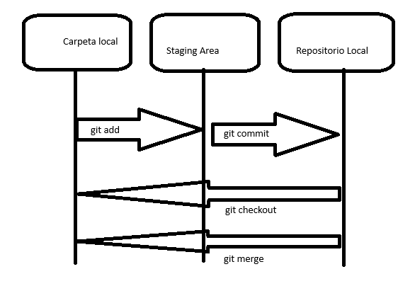

# Práctica 1. Gestión repositorio

## Objetivo de la práctica:
Al finalizar la práctica, serás capaz de:
- Configurar la información básica del usuario en Git.
- Crear un repositorio Git desde cero e inicializarlo en un proyecto.
- Crear y gestionar ramas en Git para desarrollar nuevas funcionalidades.

## Objetivo Visual 



## Duración aproximada:
- 28 minutos.

## Tabla de ayuda:

| Requisito | Descripcion|
| --- | --- |
| Git | Git instalado en el sistema operativo. |
| Editor Código | Un editor de texto como VSCode, Sublime Text o similar. |
| Terminal | Acceso a la terminal de comandos del sistema. |

## Instrucciones 

### Tarea 1. 
Paso 1. Ten configurado la informacion de usuario.

        git config --global user.name "nombre"

        git config --global user.email emai@email.cmo


        git config --list


> [!TIP]
> Debes tener en cuenta que el email sea el mismo en caso de manejar cuenta de GitHub.

Paso 2. En una carpeta crea un archivo HTML; en Éste se podrÍa Únicamente establecer una estructura HTML básica.

```html
    <!DOCTYPE html>
    <html lang="en">
    <head>
        <meta charset="UTF-8">
        <meta name="viewport" content="width=device-width, initial-scale=1.0">
        <title>Document</title>
    </head>
    <body>
        <h1>Usando Git</h1>
    </body>
    </html>
```


Paso 3. Por medio de la terminal, inicializa el repositorio.

        git init


Paso 4. Con el siguiente comando puedes visualizar que Git ya está haciendo seguimiento a nuestro archivos.

        git status


Paso 5. Con el siguiente comando, agrega el archivo al área de stage para hacer commit.

        git add .


Paso 6. Usando status, se podrá verificar que ya no está el archivo en el registro de cambios pendientes.

        git status


Paso 7. Procede a realizar commit despues de agregar el archivo al stage.

        git commit -m "Initial commit"


Paso 8. Después, procede a crear una rama y verifica que se haya realizado correctamente.

        git branch feature/list
        git branch


Paso 9. Cambia a la rama creada y modifica el HTML con una lista o otro contenido.

        git checkout feature/list
        git branch


```html
    <!DOCTYPE html>
    <html lang="en">
    <head>
        <meta charset="UTF-8">
        <meta name="viewport" content="width=device-width, initial-scale=1.0">
        <title>Document</title>
    </head>
    <body>
        <h1>Usando Git</h1>

        <br>

        <h2>Tecnologias</h2>

        <ul>
            <li>HTML</li>
            <li>CSS</li>
            <li>JavaScript</li>
            <li>PHP</li>
        </ul>
    </body>
    </html>
```


Paso 10. Agrega los cambios al área de stage y haz commit del cambio.

        git add .
        git commit -m "add list"


Paso 11. Cambia a la rama master y realiza el merge con la rama creada anteriormente.

        git checkout master
        git merge feature/list


Paso 12. Después de unificados los cambios, elimina la rama anteriormente creada.

        git branch -d feature/list


### Resultado esperado
Una vez eliminada, puedes verificar que los cambios aún persisten, lo que significa que todo el proceso fue realizado de forma corracta.

        git log


