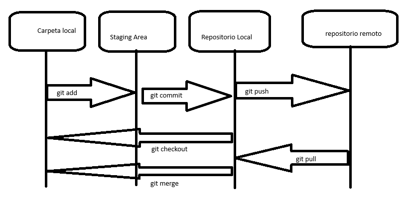

# Práctica 2. Repositorio remoto con Github Desktop

## Objetivo de la práctica:
Al finalizar la práctica, serás capaz de:
- Conectar y configurar GitHub Desktop con una cuenta de GitHub.
- Realizar y verificar pull requests desde GitHub.
- Sincronizar cambios entre el repositorio local y el repositorio remoto después de un pull request.

## Objetivo Visual: 
Crear un diagrama o imagen que resuma las actividades a realizar, un ejemplo se muestra en la siguiente imagen: 



## Duración aproximada:
- 20 minutos.

## Tabla de ayuda:

| Requisito | Descripción|
| --- | --- |
| GitHub Desktop | Instalado en el sistema operativo. |
| GitHub Account | Cuenta activa en GitHub para sincronización. |
| Repositorio Local | Un repositorio Git previamente configurado en local. |

## Instrucciones: 

### Tarea 1. Descripción de la tarea a realizar.
Paso 1. Conecta tu cuenta de GitHub con la versión de escritorio.


Selecciona la opción **"Sign into Github.com"**, esto abrirá el navegador.


Si en este punto no has iniciado sesión, te pedirá que lo realices. Finalmente, da clic a **"Continue"**.

Paso 2.  Ingresa a la opción **"Add existing repository"**.


Paso 3. Busca la ubicación de la carpeta en la cual inicializaste el repositorio, posteriomente, da clic a **"Add repository"**.


Paso 4.  Ahora en el listado de repositorios puedes observar que tu repositorio fue agregado a la herramienta de forma correcta.


Paso 5. En la parte superior se encuentra la opción **"Publish repository"**, al cual debes dar clic, esto creará el repositorio en tu cuenta de GitHub.


Paso 6. A Continuación llena la información que se solicita: nombre, descripción y selecciona el tipo de visualización (puede ser público o privado) y da clic a **"Publish repository"**.


Paso 7. Verifica el listado de repositorios de tu cuenta de GitHub y podrás observar que se ha creado correctamente con el historial de cambios que ya tenías y el código.


Paso 8. Desde GitHub Desktop crea una rama donde agregarás:
1. Primeramente el README.md.
2. Después en un nuevo commit el .gitignore donde crearás un .env .

## readme.md
```
    ## Run Locally

    Clone the project

    ```bash
    git clone https://link-to-project
    ```

    Go to the project directory

    ```bash
    cd my-project
    ```

    Install dependencies

    ```bash
    npm install
    ```

    Start the server

    ```bash
    npm run start
    ```
```


Crea el archivo README y agrega el contenido que desees.


Realiza el commit del archivo agregado y da clic en **"Commit to main"**.

## .gitingore

```
    .env
```


Crea el archivo *.env* y el gitignore de donde establecemos la ruta del .env


De esta forma, observa que el *.env* ya estará siendo seguido por git, por lo que se procede a hacer commit del gitignore.

Paso 9. Ahora con el botón con el cual anteriormente realizaste la subida del repositorio, harás la subida de los cambios realizados.


De esta forma, si revisas el repositorio remoto, puedes observar que el README y gitignore fueron cargados, pero que el *.env* fue ignorado.

Paso 10. Crea una nueva rama.


Establece el nombre a la rama.

Paso 11. Realiza nuevos cambios al archivo HTML y haz commit de éstos.

```html
    <!DOCTYPE html>
    <html lang="en">
    <head>
        <meta charset="UTF-8">
        <meta name="viewport" content="width=device-width, initial-scale=1.0">
        <title>Document</title>
    </head>
    <body>
        <h1>Usando Git</h1>

        <br>

        <h2>Tecnologias</h2>

        <ul>
            <li>HTML</li>
            <li>CSS</li>
            <li>JavaScript</li>
            <li>PHP</li>
        </ul>

        <h2>Otro cambio desde la rama creada con github desktop</h2>
    </body>
</html>
```


Realiza el commit de los cambios.

Paso 12. Publica la rama con sus cambios.


Esto hará que en GitHub, en la sección de ramas, aparezca la rama en la que estábamos trabajando.


Paso 13. Procedemos a hacer un pull request desde la web de GitHub.


Ingresa al apartado de pull request y da clic a **"New Pull Request"**.


En el select "compare", selecciona la rama en la que trabajaste, ésta será la rama que se unirá con nuestra rama principal. Finalmente, da clic a **"Create pull request"**.


Agrega información adicional, como cambiar el nombre del pull request y una descripción, haz clic a **"Create pull request"**.


Desde aquí solo podrás verificar si el cambio fue aprobado, si han comentado alguna sugerencia y quiénes lo realizaron. Da clic a **"Merge pull request"** y después en **"Confirm merge"**.


Una vez realizado el merge del pull request, puedes eliminar la rama, de lo contrario, seguirá trabajando con ella.

Paso 14. Regresa a GitHub Desktop y baja los cambios realizados por el merge request.


Asegúrate de estar en la rama *main* y, desde el mismo botón donde hiciste subida de repo y cambios, da clic, esta vez verifica si hay cambios por bajar que no tengas en tu local.


Puedes observar que dice que *hay dos cambios pendientes por bajar*. Si recuedas, hicimos un commit en la rama anterior y el otro haría referencia a la unión del código por el merge request. Debes darle clic, lo cual iniciará a bajar los cambios.

### Resultado final
Desde el editor puedes observar que todos los cambios que hiciste en la rama anterior se unificaron.


