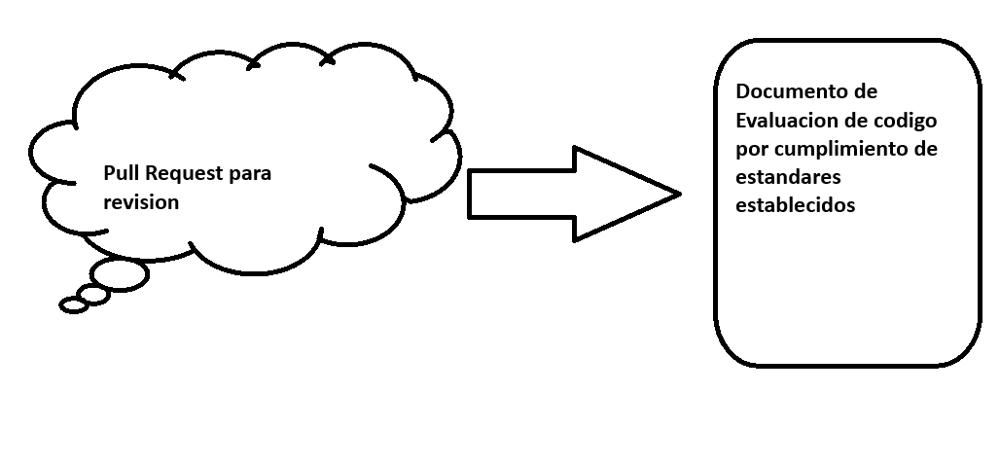
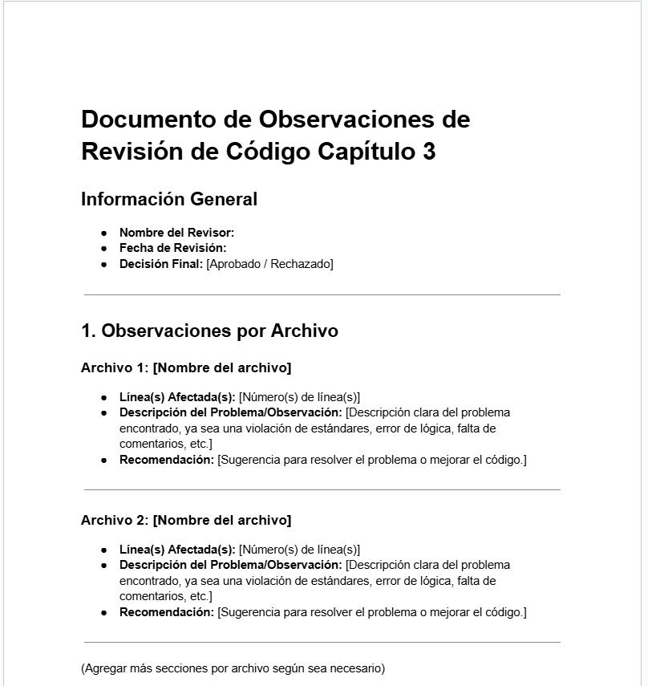

# Revision de codigo basica

## Objetivo de la práctica:
Al finalizar la práctica, serás capaz de:
- Revisar el código fuente de un repositorio y detectar problemas o errores según los estándares de calidad establecidos.
- Evaluar un pull request en GitHub identificando si los cambios propuestos cumplen con las buenas prácticas de programación y estándares definidos.
- Documentar las observaciones sobre el código, destacando los puntos que no cumplen con los estándares, y tomar una decisión informada sobre la aprobación o rechazo del pull request.

## Objetivo Visual 
Crear un diagrama o imagen que resuma las actividades a realizar, un ejemplo es la siguiente imagen. 

## Duración aproximada:
- 25 minutos.

## Tabla de ayuda:
Agregar una tabla con la información que pueda requerir el participante durante el laboratorio, como versión de software, IPs de servers, usuarios y credenciales de acceso.
| Requisito | Descripcion|
| --- | --- |
| Repositorio de GitHub | Acceso al repositorio [Netec cap3](https://github.com/mfperdomo09/netec-cap3.git). |
| GitHub Account | Cuenta activa para acceder al repositorio y revisar pull requests. |
| Repositorio Local | Un repositorio Git previamente configurado en local. |
| Documento de Evaluación | Herramienta para documentar las observaciones (puede ser un archivo de texto o similar). Formato en seccion documentos correspondiente a este capitulo |

## Instrucciones 
<!-- Proporciona pasos detallados sobre cómo configurar y administrar sistemas, implementar soluciones de software, realizar pruebas de seguridad, o cualquier otro escenario práctico relevante para el campo de la tecnología de la información -->
### Tarea 1. Descripción de la tarea a realizar.
Paso 1. Acceder al repositorio para la actividad del capitulo

En el readme se podra visualizar una lista de estandares a seguir en el codigo

Paso 2. Ingresar a la seccion de pull request

Seleccionar el pull request activo

Paso 3. En la seccion de "files changed" revisar los archivos modificados para ver si cumplen con los estandares establecidos

Paso 4.  Identificar los errores encontrados ya sea que no cumplen con los estandares establecidos o programacion orientada a objetos en general

### Resultado esperado
En un documento establecer si aprobaria el pull request, de no ser asi comentar los motivos y señalar en donde no se cumplio los estandares.

