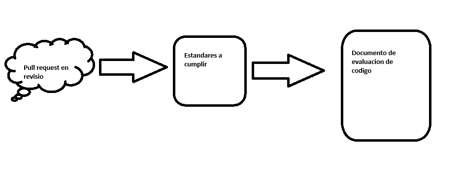

# Práctica 5. Cómo se realiza una revisión del código

## Objetivos
Al finalizar la práctica, serás capaz de:
- Familiarizarse con el Proceso de Revisión de Código
- Gestionar Repositorios Remotos y Locales
- Realizar Pull Requests y Revisiones de Código
- Aplicar Buenas Prácticas de Revisión de Código

## Objetivo Visual 

## Duración aproximada:
- 25 minutos.

## Tabla de ayuda:

| Requisito | Descripcion|
| --- | --- |
| Repositorio de GitHub | Acceso al repositorio [Netec cap5](https://github.com/mfperdomo09/netec-cap5.git). |
| GitHub Account | Cuenta activa para acceder al repositorio y revisar pull requests. |
| GitHub Desktop | Herramienta opcional para clonar y gestionar el repositorio localmente. |
| Repositorio Clonado Localmente | Clonar el repositorio localmente para una revisión más detallada si es necesario. |
| Documento de Evaluación | Herramienta para documentar las observaciones (puede ser un archivo de texto o similar). Formato en seccion documentos correspondiente a este capítulo. |

## Instrucciones 

Paso 1. Clona el repositorio en tu equipo en local.

Copia la URL del repositorio.

        git clone <url repositorio>

En la terminal, escribe `git clone url_repositorio`, lo cual clonará todo el proyecto.

Paso 2. Agrega el repositorio clonado a la herramienta de GitHub Desktop.

Ya que es un repositorio inicializado, hazlo desde **"Add existing repository"**. De esta forma, se conservarán los commits y ramas que hay.

Busca la ruta donde clonaste el repositorio.

Cambia entre ramas para que se guarden en el local.

Paso 3. Posteriormente, remueve el enlace remoto de este repositorio de la cuenta que se bajó, esto con el fin de que lo podamos subir a nuestra cuenta.

        git branch

Primero usa el comando `git branch` para verificar que las ramas ya se cargan desde el local.

        git remote -v
        git remote remove origin

Después, utiliza el comando `git remote -v` para verificar el nombre de la conexion con la otra cuenta, en este caso origin. Después, `git remote remove origin` para quitar la conexion.

        git branch

Luego, usa nuevamente el comando `git branch` y podrás ver que las ramas persiten.

Regresa a GitHub Desktop y observa que se ha habilitado la opción de **"Publicar repositorio"**. De esta forma, publícalo.

Cambia el nombre, agrega una descripcion si lo deseas y da clic en **"Publish repository"**.

Paso 4.  Ahora desde nuestra cuenta de GitHub, ingresa al repositorio.

Observa que se subieron las ramas y están listas para hacer pull request.

Paso 5.  Crea el pull request para cada una de las ramas.

Ingresa a la seccion de pull request y da clic en **"New Pull request"**.

Selecciona la rama.

Da clic a **"Create pull request"** y despues de selecciona la rama.

Da clic a **"Create pull request"**.

Paso 6. Realiza la revisión del código según los estándares definidos en el README.

Desde la seccion de **"Files chnaged"**, puedes visualizar los cambios propuestos para el pull request que irán en la rama principal.

Al encontrar algo que no vaya bien, selecciona la línea y escribe el comentarios correspondiente, agregando la posible mejora y el por qué no esta cumpliendo. Después, da clic a **"Start review"**.

Cuando finalices la review, en este caso si la pull request no cumple con los estándares, da clic a **"Review changes"** para que nuestros comentarios sean publicados; finalmente haz clic a **"Submit review"**.

En caso de que el pull request sí cumpla, en la seccion de **"Comments"** dirígete a la seción de aprobación y da clic a **"Merge pull request"** para iniciar el proceso de unificacion de cambios.

Da clic en **"Confirm merge"**, con esto finaliza el proceso de revisión.

### Resultado esperado
En un documento, redacta cómo realizaste la revision, aprobación y merge del pr, en caso de aplicar.

