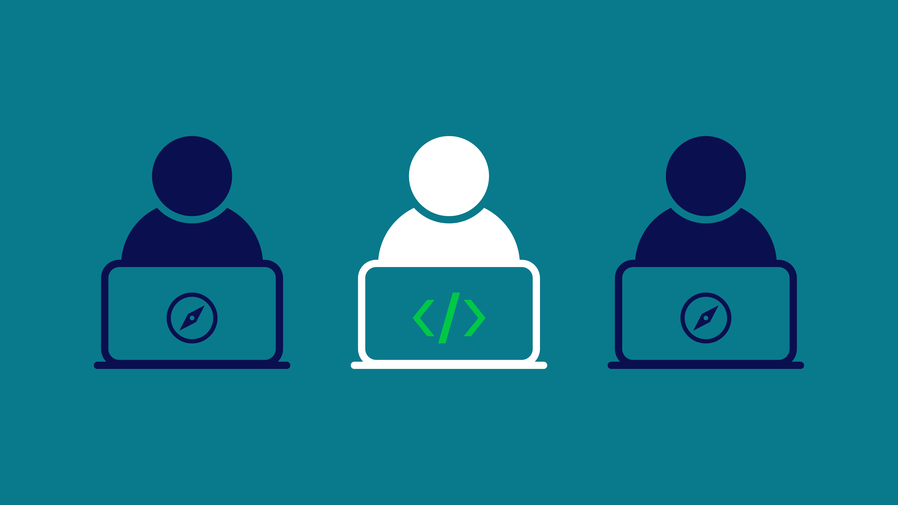

# Práctica 6. Programación en pares

## Objetivo de la práctica:
Al finalizar la práctica, serás capaz de:
- Desarrollar habilidades de programación en pares.

## Objetivo Visual 



Imagen de Codio, 25 de agosto 2021 [Codio](https://www.codio.com/blog/3-collaborative-coding-practices-pair-programming-peer-instruction)

## Duración aproximada:
- 26 minutos.

## Tabla de ayuda:

| Requisito | Descripción|
| --- | --- |
| GitHub Account | Cuenta activa para acceder al repositorio y revisar pull requests. |
| GitHub Desktop | Herramienta opcional para clonar y gestionar el repositorio localmente. |
| Laragon | Herramienta para iniciar servicios de PHP, Apache y MySQL. |
| Composer | Utilizado para instalar Laravel y sus dependencias. Incluido en Laragon. |
| Editor de Código | Recomendado para modificar archivos (ej. Visual Studio Code). |
| Terminal/Comando CLI | Necesario para ejecutar comandos de Git y Laravel. |
| PHP8 y MySQL | Lenguaje y base de datos utilizados en el proyecto Laravel. Incluidos en Laragon. |

## Instrucciones 

Paso 1. Para iniciar, desde Laragon inicia los servicios de MySQL para base de datos y Apache.


Paso 2. Desde la terminal en la carpeta www correspondiente a Laragon, ejecuta el siguiente comando de composer: `composer create-project laravel/laravel nombre-poryecto` y espera hasta que finalice.

        composer create-project laravel/laravel nombre_proyecto


Paso 3. Ingresa al proyecto y, dentro del archivo *.env*, descomenta las líneas 23 a la 27 y en la línea 22 cambia el valor a MySQL.

## .env
```
    DB_CONNECTION=mysql
    DB_HOST=localhost
    DB_PORT=3306
    DB_DATABASE=laravel
    DB_USERNAME=root
    DB_PASSWORD=
```


Paso 4.  En GitHub Desktop, agrega el proyecto.


Como este proyecto no se inicializó en Git, da clic en **"Create a repository"**.


Establece la información necesaria, en este caso con el nombre es sufuciente.


Una vez agregado puedes publicar el repositorio en tu cuenta.

Paso 5.  En la terminal, ingresa el comando `php artisan serve`.

        php artisan serve


Esto hará que se inicie un servicio local donde podrás hacer uso de la URL que te genera, da `CTRL + clic`, el cual abrirá el navegador y permitirá visualizar la presentacion de Laravel.

Paso 6. Dentro del proyecto busca el archivo *"UserFactory"* en la ruta **"database/factories"**.


Verifica que el código sea el mismo, esto con el fin de generar datos de prueba en la base de datos.

Paso 7. Ahora, en la ruta **"database/seeders"**, busca el archivo *"DatabaseSeeder.php"*.

## DatabaseSeeder.php
```php
    <?php

    namespace Database\Seeders;

    use App\Models\User;
    // use Illuminate\Database\Console\Seeds\WithoutModelEvents;
    use Illuminate\Database\Seeder;

    class DatabaseSeeder extends Seeder
    {
        /**
         * Seed the application's database.
         */
        public function run(): void
        {
            User::factory(10)->create();
        }
    }
```


Desconecta la línea `User::Factory` y elimina el resto.

Paso 8. Corre las migraciones con los seeders para crear la base de datos e inserta los datos `php artisan migrate --seed`.

        php artisan migrate --seed

Al ser la primera vez con este proyecto te preguntará si se debe crear una base de datos ya que no existe, de tal forma, selecciona:

        yes


Preguntará si quieres crear la base de datos; escribe `yes` y da **Enter**.

Paso 9. Realiza commit de los cambios y push para que suban al repositorio remoto.


Paso 10. Crea una rama donde crearás un listado de los usuarios.


Después de crearla, publícala.


Paso 11. Usa el comando `php artisan make:controller UserController`, esto creará un archivo controllador en la ruta **"app/Http/Controllers"**
donde podrás crear los métodos correspondientes.

        php artisan make:controller UserController


Paso 12. En el archivo controllador que creaste, escribe el método index, donde primero deberás traer todos los registros de la tabla usuario, luego retonamos la vista la cual estaria en la ruta **"views/user/"** junto con todo los registro de usuarios.

```php
    <?php

    namespace App\Http\Controllers;

    use App\Models\User;
    use Illuminate\Http\Request;

    class UserController extends Controller
    {
        public function index()
        {
            $users = User::all();

            return view('user.index', compact('users'));
        }
    }
```


Paso 13. Ingresa al archivo *"web.php"*, el cual es el archivo de rutas o urls de accesso que generaste.


```
    Route::get('/', [UserController::class, 'index']);
```


La ruta que se encuentra ahí, debes modificarla para que no reciba una función si no un array con dos items: primero el controlador de usuario y el método que llamará esa ruta; en este caso, el método index.

Paso 14. Luego en la ruta de carpetas **"resource/views/"**, crea una carpeta **"user"** y, dentro de ésta, un archivo llamado **"index.blade.php"**.


De esta foma, observa que concuerda con la ruta que se estableció en el controlador **"user.index"**.

Paso 15. En el archivo index, crea la siguiente estructura HTML5 donde, por medio de un foreach, recorre la coleccion de registros que enviaste del controlador.

## views/user/index.blade.php
```html
    <!DOCTYPE html>
    <html lang="en">
    <head>
        <meta charset="UTF-8">
        <meta name="viewport" content="width=device-width, initial-scale=1.0">
        <meta http-equiv="X-UA-Compatible" content="ie=edge">
        <title>Users</title>
    </head>
    <body>
    
        <h1>User List</h1>
    
        <br>
        <br>
    
        <table>
            <thead>
                <tr>
                    <th>ID</th>
                    <th>Name</th>
                    <th>Email</th>
                    <th>Created At</th>
                    <th>Updated At</th>
                </tr>
            </thead>
    
            <tbody>
                @foreach ($users as $user)
                    <tr>
                        <td>{{$user->id}}</td>
                        <td>{{$user->name}}</td>
                        <td>{{$user->email}}</td>
                        <td>{{$user->created_at}}</td>
                        <td>{{$user->updated_at}}</td>
                    </tr>
                @endforeach
            </tbody>
        </table>
    
    </body>
    </html>
```


Paso 16. Finalmente, desde el navegador recarga la página y observa que carga el listado de usuarios registrados.


### Resultado final


