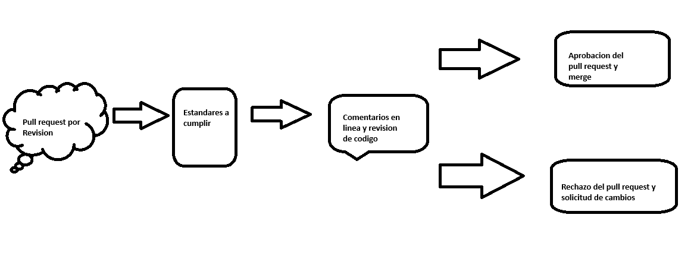
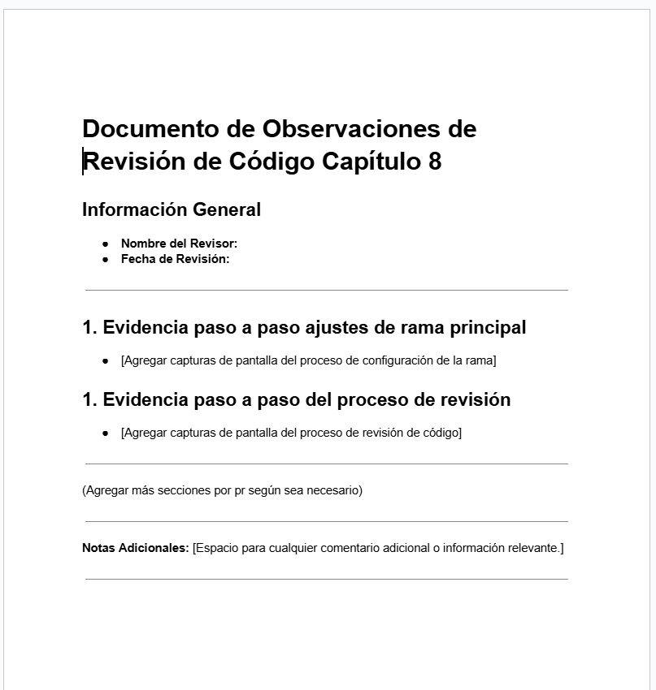

# Capitulo 8: Simulacion completa de revision de codigo

## Objetivo de la práctica:
Al finalizar la práctica, serás capaz de:
- Comprender el flujo completo de trabajo en un entorno colaborativo de desarrollo de software.
- Configurar la protección de ramas.

## Objetivo Visual 
Crear un diagrama o imagen que resuma las actividades a realizar, un ejemplo es la siguiente imagen. 

## Duración aproximada:
- 40 minutos.

## Tabla de ayuda:
Agregar una tabla con la información que pueda requerir el participante durante el laboratorio, como versión de software, IPs de servers, usuarios y credenciales de acceso.
| Requisito | Descripcion|
| --- | --- |
| GitHub Account | Cuenta activa para acceder al repositorio y revisar pull requests. |
| GitHub Desktop | Herramienta opcional para clonar y gestionar el repositorio localmente. |
| Editor de Código | Recomendado para modificar archivos (ej. Visual Studio Code). |
| Terminal/Comando CLI | Necesario para ejecutar comandos de Git y Laravel. |
| Correo Electrónico | Acceso al correo electrónico asociado a la cuenta de GitHub para aceptar la invitación como colaborador y recibir notificaciones sobre las revisiones. |
| Permisos de Propietario | Permisos necesarios en GitHub para configurar la protección de ramas y gestionar pull requests en el repositorio. |
| Documento de Evaluación | Herramienta para documentar las observaciones (puede ser un archivo de texto o similar). Formato en seccion documentos correspondiente a este capitulo |

## Instrucciones 
<!-- Proporciona pasos detallados sobre cómo configurar y administrar sistemas, implementar soluciones de software, realizar pruebas de seguridad, o cualquier otro escenario práctico relevante para el campo de la tecnología de la información -->
### Tarea 1. Descripción de la tarea a realizar.

Paso 1. Crearemos un repositorio de forma local

Paso 2. Agregaremos el repositorio al github desktop y lo publicaremos en nuestra cuenta

Paso 3. Agregaremos contenido al repositorio ya sea con laravel php, o archivos html, js o css

Paso 4. Agregamos la regla de proteccion a nuestra rama principal, para controlar los pull request, solo cuando esten aprobados y sin solictudes de cambios pendientes

Paso 5. Daremos acceso a uno de nuestro compañero que hara de colaborador

* Crear rama
* Realizar modificaciones en la rama creada simulando error
* relizar pull request
* El dueño del repo solicitara cambios
* El autor realizara los cambios y los subira marcando la solicitud como resulta
* El Dueño verificara dichos cambios y aprobara

Paso 4. Una vez aprobado ya sea el autor o el dueño realizar el merge del pull request.

### Resultado esperado
Documento en el que se evidenciara el como realizo el ajuste de ramas para la seguridad del pull request y revision de codigo obligatorio. Como tambien evidencia del proceso de revision de codigo.

